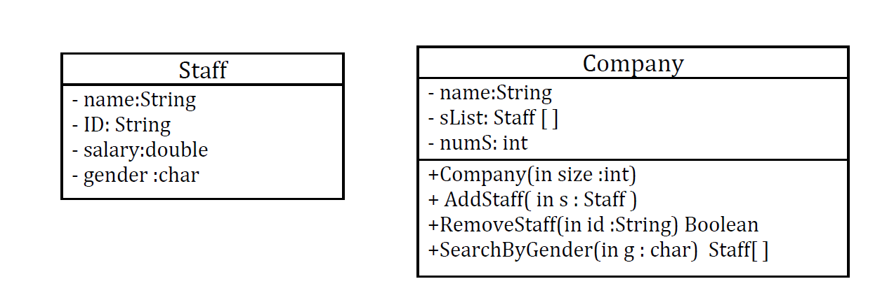

# hw-week4-day2-dataStructures


---
## Array:



Implement the methods located in Class Company in **src/com.ga.array** where you find 

```java
// your code goes here
```


---
## ArrayList: 
Sometimes it's better to use dynamic size arrays. Java's Arraylist can provide you this feature. Try to solve this problem using Arraylist.


**Congratulations** You have just opened your own pizzeria since your customers are the chefs, they will need a list to keep track of  all the ingredients they choose.(no menu, just take whatever they print)
 
 - Keep adding to the ArrayList while the user is not saying done.
 - Print the ingredients to the user and ask him/her to confirm or edit :
   1. if user chooses to edit ask for the specfic ingredient and change it with the new one.
   2. if user confirms his/her order print a confirmation message.

   (Assume correct user inputs)

### Add Menu :

You did not like the old way so you decided to have a menu :
- Create a function called Menu().
- Inside the function:
   1. Create a ``` HashMap ``` object called menu.
   2. add dishes and prices as keys and values.
   3. print the menu
